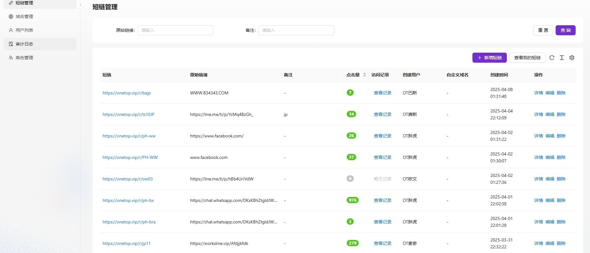
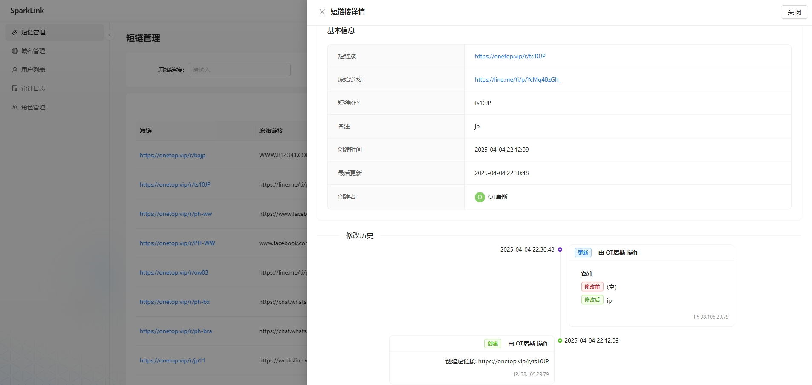
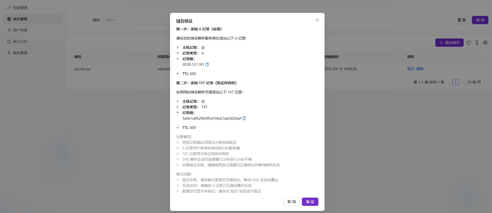
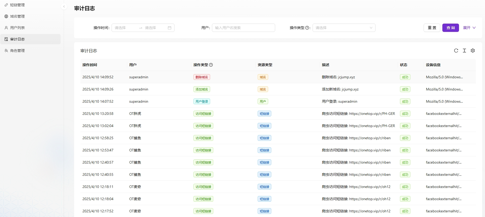
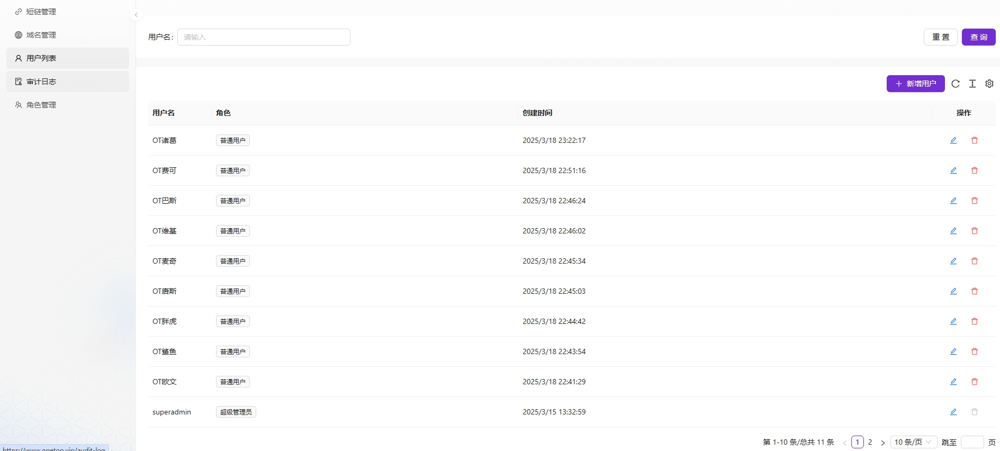
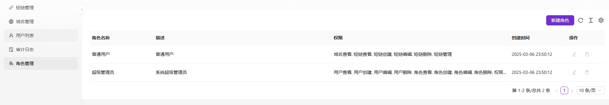

# ShortLink - 短链接管理平台前端

这是基于 [Ant Design Pro](https://pro.ant.design) 开发的短链接管理平台前端项目。

## 项目概述

ShortLink 是一个功能完善的短链接生成与管理系统，提供短链接创建、管理、统计等功能。本项目是系统的前端部分，采用现代化的 React 技术栈构建。

### 核心功能

- 短链接创建与管理
- 自定义域名支持
- 点击数据统计和分析
- 用户权限管理（RBAC 权限系统）
- 多语言国际化
- 支持暗黑模式

## 技术栈

- React 18
- UmiJS 4
- Ant Design 5
- Ant Design Pro Components
- TypeScript
- React Query
- Moment.js
- GitHub Actions (CI/CD)

## 开发环境准备

安装依赖:

```bash
npm install
# 或
yarn
```

## 常用脚本命令

项目提供了多种脚本命令，便于开发和部署：

### 启动项目

```bash
# 开发环境
npm start
# 或使用特定环境
npm run start:dev
npm run start:test
npm run start:pre
```

### 构建项目

```bash
# 生产环境构建
npm run build:prod
# 其他环境构建
npm run build:dev
npm run build:test
npm run build:pre
```

### 代码检查

```bash
# 代码风格检查
npm run lint
# 自动修复代码风格问题
npm run lint:fix
```

### 测试代码

```bash
npm test
```

## 部署

项目使用 GitHub Actions 实现自动化部署流程，当代码推送到`release/181`分支时会自动触发构建和部署流程：

1. 检出代码
2. 安装依赖
3. 构建项目
4. 将构建产物部署到服务器
5. 重启 Nginx 服务

### 手动部署

如需手动部署，可以执行：

```bash
npm run deploy
```

## 项目结构

```
src/
├── access.ts            # 权限控制
├── app.tsx              # 应用入口
├── components/          # 公共组件
├── constants/           # 常量定义
├── hooks/               # 自定义Hooks
├── locales/             # 国际化资源
├── models/              # 全局数据模型
├── pages/               # 页面组件
│   ├── ShortLink/       # 短链接管理页面
│   ├── UserManagement/  # 用户管理页面
│   ├── RoleManagement/  # 角色管理页面
│   └── ...
├── services/            # API服务
├── utils/               # 工具函数
└── global.less          # 全局样式
```

     
